# Kunbi Samaj Matrimony Application - Design Phase Documentation

## Table of Contents
1. [System Architecture](#system-architecture)
2. [User Flow Diagram](#user-flow-diagram)
3. [Sequence Diagrams](#sequence-diagrams)
4. [Entity Relationship Diagram](#entity-relationship-diagram)
5. [State Diagrams](#state-diagrams)
6. [Component Architecture](#component-architecture)

---

## 1. System Architecture

---

## 2. User Flow Diagram

### 2.1 Complete User Journey

---

## 3. Sequence Diagrams

### 3.1 Registration & Verification Flow

### 3.2 Interest Sending & Acceptance Flow

### 3.3 Profile Completion & Family Approval Flow

### 3.4 Meeting & Success Flow

---

## 4. Entity Relationship Diagram

```mermaid
erDiagram
    USER ||--o{ PROFILE : has
    USER ||--o{ LOGIN_SESSION : has
    USER ||--o{ NOTIFICATION : receives
    
    PROFILE ||--|| PERSONAL_DETAILS : contains
    PROFILE ||--|| EDUCATION : contains
    PROFILE ||--|| OCCUPATION : contains
    PROFILE ||--|| FAMILY_BACKGROUND : contains
    PROFILE ||--|| RELIGIOUS_DETAILS : contains
    PROFILE ||--|| LIFESTYLE : contains
    PROFILE ||--|| PARTNER_EXPECTATIONS : contains
    PROFILE ||--o{ PHOTO : has
    PROFILE ||--o| VIDEO : has
    PROFILE ||--o{ SOCIAL_MEDIA : links
    PROFILE ||--o{ VERIFICATION_DOCUMENT : has
    
    PROFILE ||--o{ INTEREST_SENT : sends
    PROFILE ||--o{ INTEREST_RECEIVED : receives
    PROFILE ||--o{ SHORTLIST : creates
    PROFILE ||--o{ BLOCKED_USER : blocks
    
    INTEREST_SENT ||--|| INTEREST_RECEIVED : matches
    INTEREST_SENT ||--o| CONNECTION : creates
    
    CONNECTION ||--o{ MESSAGE : contains
    CONNECTION ||--o{ MEETING : schedules
    
    ADMIN ||--o{ PROFILE_VERIFICATION : performs
    ADMIN ||--o{ REPORT_REVIEW : handles
    ADMIN ||--o{ ANNOUNCEMENT : creates
    
    PROFILE ||--o{ REPORT : reported_in
    
    SUCCESS_STORY ||--|| CONNECTION : created_from

    USER {
        int user_id PK
        string mobile_number UK
        string email
        datetime created_at
        datetime last_login
        enum user_type "self/son/daughter/brother/sister"
        enum status "pending/verified/suspended/deleted"
    }
    
    PROFILE {
        int profile_id PK
        int user_id FK
        enum status "draft/pending_family/pending_admin/live/engaged/hidden"
        datetime verified_at
        int verified_by FK
        datetime last_updated
        int view_count
        boolean is_premium
    }
    
    PERSONAL_DETAILS {
        int detail_id PK
        int profile_id FK
        string full_name
        date date_of_birth
        int age
        string height
        int weight_kg
        enum complexion "fair/wheatish/dusky/dark"
        enum body_type "slim/average/athletic/heavy"
        string blood_group
        boolean physically_challenged
        string health_details
        boolean spectacles
    }
    
    EDUCATION {
        int education_id PK
        int profile_id FK
        string highest_education
        string college_university
        int year_of_passing
        string percentage_cgpa
        string additional_qualifications
        boolean currently_studying
        string current_course
    }
    
    OCCUPATION {
        int occupation_id PK
        int profile_id FK
        enum occupation_type "private/government/business/professional/farmer/not_working/student"
        string job_title
        string company_name
        int experience_years
        decimal monthly_income
        string job_location
        enum job_stability "permanent/contract/temporary"
        text future_plans
    }
    
    FAMILY_BACKGROUND {
        int family_id PK
        int profile_id FK
        string father_name
        int father_age
        string father_occupation
        decimal father_income
        string mother_name
        int mother_age
        string mother_occupation
        int num_brothers
        int num_sisters
        enum family_type "nuclear/joint"
        string native_place
        string native_district
        string current_address
        enum residential_status "own/rented/family_property"
        text property_assets
        decimal family_annual_income
    }
    
    FAMILY_MEMBER {
        int member_id PK
        int family_id FK
        enum relation "brother/sister"
        string name
        int age
        string occupation
        boolean is_married
        string spouse_name
        string spouse_occupation
        string settled_location
    }
    
    RELIGIOUS_DETAILS {
        int religious_id PK
        int profile_id FK
        string religion
        string caste
        string sub_caste
        string gotra
        enum manglik "yes/no/dont_know/dont_believe"
        string nakshatra
        string rashi
        time birth_time
        string birth_place
        boolean show_kundali
    }
    
    LIFESTYLE {
        int lifestyle_id PK
        int profile_id FK
        enum food_preference "pure_veg/veg_egg/non_veg"
        enum smoking "no/occasionally/regularly"
        enum drinking "no/occasionally/regularly"
        enum religiousness "very/religious/moderate/not"
        time wake_up_time
        time sleep_time
        boolean exercise
        text hobbies
        text languages_known
        enum computer_knowledge "expert/good/basic/none"
    }
    
    PARTNER_EXPECTATIONS {
        int expectation_id PK
        int profile_id FK
        int age_min
        int age_max
        string height_min
        string height_max
        string minimum_education
        text occupation_preference
        decimal minimum_income
        text location_preference
        enum manglik_preference "only_manglik/only_non_manglik/doesnt_matter"
        enum family_type_preference "nuclear/joint/both"
        text description
    }
    
    PHOTO {
        int photo_id PK
        int profile_id FK
        string file_path
        enum photo_type "individual_traditional/individual_casual/family/full_body/additional"
        int display_order
        boolean is_primary
        datetime uploaded_at
        enum status "pending/approved/rejected"
    }
    
    VIDEO {
        int video_id PK
        int profile_id FK
        string file_path
        int duration_seconds
        datetime uploaded_at
        enum status "pending/approved/rejected"
    }
    
    SOCIAL_MEDIA {
        int social_id PK
        int profile_id FK
        enum platform "instagram/facebook/linkedin/youtube"
        string profile_url
        boolean is_verified
        json selected_posts
        datetime linked_at
    }
    
    VERIFICATION_DOCUMENT {
        int doc_id PK
        int profile_id FK
        enum doc_type "aadhaar_front/aadhaar_back/selfie_aadhaar/family_photo"
        string file_path
        datetime uploaded_at
        enum status "pending/verified/rejected"
    }
    
    REFERENCE {
        int reference_id PK
        int profile_id FK
        string reference_name
        string reference_mobile
        boolean is_verified
        datetime verified_at
        int verified_by FK
        text admin_notes
    }
    
    INTEREST_SENT {
        int interest_id PK
        int sender_profile_id FK
        int receiver_profile_id FK
        text introduction_message
        datetime sent_at
        enum status "pending/accepted/rejected/question_asked"
        datetime status_updated_at
    }
    
    INTEREST_RECEIVED {
        int interest_id PK
        int receiver_profile_id FK
        int sender_profile_id FK
        boolean is_read
        datetime read_at
        text question
        text answer
        string rejection_reason
    }
    
    CONNECTION {
        int connection_id PK
        int profile_a_id FK
        int profile_b_id FK
        datetime connected_at
        enum status "active/meeting_arranged/in_progress/engaged/closed"
        text status_notes
        datetime last_updated
    }
    
    MESSAGE {
        int message_id PK
        int connection_id FK
        int sender_profile_id FK
        text message_content
        datetime sent_at
        boolean is_read
    }
    
    MEETING {
        int meeting_id PK
        int connection_id FK
        date meeting_date
        time meeting_time
        string venue
        enum meeting_type "our_place/their_place/neutral"
        text notes
        enum outcome "very_positive/positive/neutral/not_interested"
        text feedback
        datetime created_at
    }
    
    SHORTLIST {
        int shortlist_id PK
        int profile_id FK
        int shortlisted_profile_id FK
        datetime added_at
        text notes
    }
    
    BLOCKED_USER {
        int block_id PK
        int blocker_profile_id FK
        int blocked_profile_id FK
        datetime blocked_at
        text reason
    }
    
    ADMIN {
        int admin_id PK
        string name
        string mobile
        string email
        enum role "super_admin/committee_member/moderator"
        datetime created_at
    }
    
    PROFILE_VERIFICATION {
        int verification_id PK
        int profile_id FK
        int admin_id FK
        datetime verified_at
        enum action "approved/rejected/need_more_info"
        text admin_notes
        text rejection_reason
    }
    
    REPORT {
        int report_id PK
        int reported_profile_id FK
        int reporter_profile_id FK
        enum reason "fake/wrong_info/inappropriate/harassment/other"
        text details
        string proof_file_path
        datetime reported_at
        enum status "pending/under_review/action_taken/dismissed"
        int reviewed_by FK
        text admin_action
    }
    
    ANNOUNCEMENT {
        int announcement_id PK
        int created_by FK
        string title
        text content
        datetime published_at
        boolean is_active
    }
    
    SUCCESS_STORY {
        int story_id PK
        int connection_id FK
        date engagement_date
        text story_description
        json photos
        boolean is_published
        datetime created_at
        int likes_count
    }
    
    NOTIFICATION {
        int notification_id PK
        int user_id FK
        enum type "interest_received/interest_accepted/profile_viewed/message/meeting_reminder/admin"
        text content
        boolean is_read
        datetime created_at
    }
    
    LOGIN_SESSION {
        int session_id PK
        int user_id FK
        string device_id
        string device_type
        string fcm_token
        datetime login_at
        datetime last_active
    }
```

---

## 5. State Diagrams

### 5.1 Profile Status State Machine

### 5.2 Interest Status State Machine

### 5.3 Admin Verification Flow

---

## 6. Component Architecture

### 6.1 Frontend Component Hierarchy

### 6.2 Backend Service Architecture

### 6.3 Mobile App Architecture (MVVM Pattern)

---

## 7. Data Flow Diagrams

### 7.1 Interest Sending & Matching Process

### 7.2 Social Media Integration Flow

---

## 8. Security Architecture

---

## 9. Deployment Architecture

---

## 10. Key Design Decisions

### 10.1 Privacy by Design
- **Contact Details Locked**: Phone numbers, email, and social media are hidden until mutual interest
- **Two-Layer Approval**: Profile must be approved by both admin committee and family
- **Curated Social Media**: Users select specific posts to share, not entire profiles
- **Blocking & Reporting**: Users can block profiles and report issues

### 10.2 Verification Mechanisms
- **Three-Level Verification**:
  1. Mobile OTP verification
  2. Aadhaar document verification
  3. Reference verification by calling existing members
- **Admin Review**: Human verification by samaj committee members
- **Photo Verification**: Selfie with Aadhaar to prevent fake profiles

### 10.3 Data Architecture Decisions
- **PostgreSQL** for relational data (profiles, interests, connections)
- **Redis** for caching frequently accessed data (active profiles, search results)
- **S3/Cloud Storage** for media files (photos, videos)
- **Message Queue** for asynchronous tasks (notifications, email)

### 10.4 Scalability Considerations
- Horizontal scaling with load balancers
- Database read replicas for search queries
- CDN for media delivery
- Caching layer to reduce database load
- Asynchronous processing for non-critical tasks

### 10.5 Mobile-First Approach
- Responsive web design
- Native mobile apps (Android & iOS)
- Offline capability for viewing cached profiles
- Push notifications for real-time updates
- Low bandwidth optimization for rural areas

---

## 11. Technology Stack Recommendations

### Frontend
- **Web**: React.js / Vue.js with TypeScript
- **Mobile**: 
  - Android: Kotlin with Jetpack Compose
  - iOS: Swift with SwiftUI
  - Cross-platform: React Native (if budget constrained)

### Backend
- **API**: Node.js (Express) or Python (FastAPI)
- **Database**: PostgreSQL 14+
- **Cache**: Redis 7+
- **Message Queue**: RabbitMQ or AWS SQS
- **Storage**: AWS S3 or Google Cloud Storage

### DevOps
- **Containerization**: Docker
- **Orchestration**: Kubernetes or AWS ECS
- **CI/CD**: GitHub Actions or GitLab CI
- **Monitoring**: Prometheus + Grafana
- **Logging**: ELK Stack (Elasticsearch, Logstash, Kibana)

### External Services
- **SMS**: Twilio or AWS SNS
- **Email**: SendGrid or AWS SES
- **Push Notifications**: Firebase Cloud Messaging
- **Analytics**: Google Analytics + Mixpanel
- **Error Tracking**: Sentry

---

## Summary

This design document provides a comprehensive technical blueprint for the Kunbi Samaj Matrimony Application including:

1. **System Architecture**: Microservices-based architecture with clear separation of concerns
2. **User Flows**: Complete journey from registration to engagement
3. **Database Design**: Normalized ER diagram with 25+ entities
4. **State Management**: State machines for profile and interest lifecycles
5. **Security**: Multi-layered security with privacy controls
6. **Scalability**: Cloud-native architecture with auto-scaling capabilities

The application is designed to be:
- **User-friendly**: Simple flows for non-technical users
- **Privacy-focused**: Contact details protected until mutual interest
- **Community-driven**: Samaj committee verification and involvement
- **Scalable**: Can handle thousands of profiles and concurrent users
- **Secure**: Multiple verification layers and data protection

This architecture supports the unique requirements of a community-based matrimony platform while maintaining modern software engineering best practices.