# 📊 KUNBI VIVAH - COMPLETE DATABASE FLOW

### 1. AUTHENTICATION FLOW

| Step | Action | API Route | Database Tables | Result |
|------|--------|-----------|----------------|--------|
| 1 | User enters phone | `POST /auth/send-otp` | `otp_requests` | OTP sent via SMS |
| 2 | User enters OTP | `POST /auth/verify-otp` | `users`, `devices`, `sessions`, `otp_requests` | Access + Refresh tokens |
| 3 | Token expires | `POST /auth/refresh` | `sessions` | New access token |
| 4 | User logs out | `POST /auth/logout` | `sessions` | Session revoked |

---

### 2. PROFILE CREATION FLOW

| Step | Action | API Route | Database Tables | Data Collected |
|------|--------|-----------|----------------|----------------|
| 1 | Basic info | `POST /profiles/create/step1` | `profiles`, `villages` | Name, DOB, Gender, Village |
| 2 | Education & Career | `POST /profiles/create/step2` | `profiles` | Education, Job, Income, Family |
| 3 | About & Preferences | `POST /profiles/create/step3` | `profiles`, `profile_preferences` | Bio, Siblings, Partner preferences |
| 4 | Complete profile | `POST /profiles/complete` | `profiles` | `completed_at` timestamp set |
| 5 | Upload photos | `POST /photos/upload` | `profile_photos` | Photos (pending approval) |

---

### 3. SEARCH & BROWSE FLOW

| Step | Action | API Route | Database Query | Stage |
|------|--------|-----------|---------------|-------|
| 1 | Search profiles | `POST /search/profiles` | `profiles` + filters | Stage 1: Anonymous |
| 2 | View profile | `GET /profiles/:id` | `profiles`, `villages`, `profile_preferences` | Stage 1: No name/photos |
| 3 | Check if blocked | - | `blocks` table | Skip if blocked |
| 4 | Log profile view | - | `audit_logs` | Track analytics |

---

### 4. INTEREST FLOW (CRITICAL)

| Step | Action | API Route | Tables | Status Change |
|------|--------|-----------|--------|---------------|
| 1 | Send interest | `POST /interests/send` | `interests` | `status: pending` |
| 2 | Receiver views | `GET /interests/received` | `interests`, `profiles` | - |
| 3a | Receiver accepts | `PUT /interests/:id/accept` | `interests` | `status: accepted` |
| 3b | Receiver rejects | `PUT /interests/:id/reject` | `interests` | `status: rejected` |
| 3c | Receiver asks Q | `POST /interests/:id/question` | `interest_questions` | `status: pending` |
| 4 | Sender answers | `PUT /interests/:id/answer` | `interest_questions` | - |
| 5 | Both accepted? | Check both sides | `interests` | If yes → Connection |
| 6 | Create connection | Auto-created | `connections` | `status: active` |

---

### 5. CONNECTION PROGRESSIVE UNLOCK FLOW

```mermaid
flowchart LR
    A[Stage 1: Search] -->|Send Interest| B[Stage 2: Both Accept]
    B -->|Unlock Names| C[Stage 2: Names + Family Photos]
    C -->|Request Contact| D[Stage 3: Phone Numbers]
    D -->|Families Approve| E[Stage 4: Individual Photos]
    E -->|Engaged| F[Success! 💍]
```

| Stage | Unlocked Data | API Trigger | Tables Accessed | Who Can See |
|-------|---------------|-------------|-----------------|-------------|
| **Stage 1** | Age, Education, Job, Village | `GET /profiles/:id` | `profiles`, `villages` | Anyone (anonymous) |
| **Stage 2** | Full names, Family photos | Interest accepted | `profiles`, `profile_photos` (family only) | Both profiles |
| **Stage 3** | Phone numbers, Address | `POST /connections/:id/unlock-contact` | `profiles` (full data) | Both profiles |
| **Stage 4** | Individual photos, Full access | `PUT /connections/:id/family-approve` | `profile_photos` (all) | Both profiles |

---

### 6. CONNECTION STATUS PROGRESSION

| Status | Action | API Route | Tables | Next Status |
|--------|--------|-----------|--------|-------------|
| `active` | Connection created | Auto | `connections` | `family_approved` |
| `family_approved` | Families approve | `PUT /connections/:id/family-approve` | `connections`, `connection_status_logs` | `engaged` |
| `engaged` | Engagement confirmed | `PUT /connections/:id/engaged` | `connections`, `profiles` | END (success) |
| `broken` | Someone breaks connection | `PUT /connections/:id/break` | `connections`, `connection_status_logs` | END |

---

### 7. PHOTO APPROVAL FLOW (If Admin Required)

| Step | Action | API Route | Tables | Status |
|------|--------|-----------|--------|--------|
| 1 | User uploads | `POST /photos/upload` | `profile_photos` | `status: pending` |
| 2 | Admin reviews | `GET /admin/photos/pending` | `profile_photos` | - |
| 3a | Admin approves | `PUT /admin/photos/:id/approve` | `profile_photos` | `status: approved` |
| 3b | Admin rejects | `PUT /admin/photos/:id/reject` | `profile_photos` | `status: rejected` |

---

### 8. BLOCKING & REPORTING FLOW

| Action | API Route | Tables | Effect |
|--------|-----------|--------|--------|
| Block user | `POST /blocks` | `blocks` | Blocked profile disappears from search |
| Report user | `POST /reports` | `reports` | Admin reviews report |
| Admin reviews | `PUT /admin/reports/:id` | `reports` | Admin takes action |
| Admin suspends | `PUT /admin/users/:id/suspend` | `users` | User can't login |

**This is your complete system flow!** 🎯

Every table, every route, every status transition mapped out!