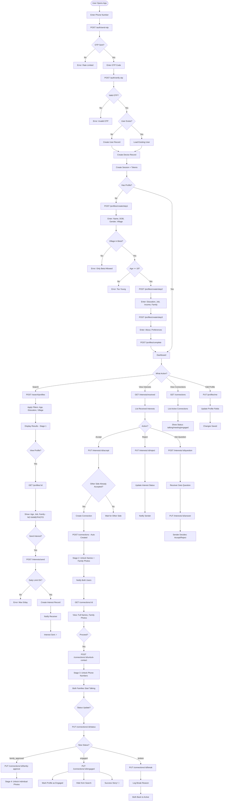

```mermaid
    flowchart TD
    Start([User Opens App]) --> A1[Enter Phone Number]
    A1 --> A2[POST /auth/send-otp]
    A2 --> A3{OTP Sent?}
    A3 -->|No| A4[Error: Rate Limited]
    A3 -->|Yes| A5[Enter OTP Code]
    
    A5 --> A6[POST /auth/verify-otp]
    A6 --> A7{Valid OTP?}
    A7 -->|No| A8[Error: Invalid OTP]
    A7 -->|Yes| A9{User Exists?}
    
    A9 -->|No| B1[Create User Record]
    A9 -->|Yes| B2[Load Existing User]
    
    B1 --> B3[Create Device Record]
    B2 --> B3
    
    B3 --> B4[Create Session + Tokens]
    B4 --> B5{Has Profile?}
    
    B5 -->|No| C1[POST /profiles/create/step1]
    B5 -->|Yes| D1[Dashboard]
    
    C1 --> C2[Enter: Name, DOB, Gender, Village]
    C2 --> C3{Village in Betul?}
    C3 -->|No| C4[Error: Only Betul Allowed]
    C3 -->|Yes| C5{Age >= 18?}
    C5 -->|No| C6[Error: Too Young]
    C5 -->|Yes| C7[POST /profiles/create/step2]
    
    C7 --> C8[Enter: Education, Job, Income, Family]
    C8 --> C9[POST /profiles/create/step3]
    C9 --> C10[Enter: About, Preferences]
    C10 --> C11[POST /profiles/complete]
    C11 --> D1
    
    D1 --> E1{What Action?}
    
    E1 -->|Search| F1[POST /search/profiles]
    E1 -->|View Interests| G1[GET /interests/received]
    E1 -->|View Connections| H1[GET /connections]
    E1 -->|Edit Profile| I1[PUT /profiles/me]
    
    F1 --> F2[Apply Filters: Age, Education, Village]
    F2 --> F3[Display Results - Stage 1]
    F3 --> F4{View Profile?}
    F4 -->|Yes| F5[GET /profiles/:id]
    F5 --> F6[Show: Age, Job, Family - NO NAME/PHOTO]
    F6 --> F7{Send Interest?}
    
    F7 -->|Yes| J1[POST /interests/send]
    J1 --> J2{Daily Limit OK?}
    J2 -->|No| J3[Error: Max 5/day]
    J2 -->|Yes| J4[Create Interest Record]
    J4 --> J5[Notify Receiver]
    J5 --> K1[Interest Sent ✓]
    
    G1 --> G2[List Received Interests]
    G2 --> G3{Action?}
    
    G3 -->|Accept| L1[PUT /interests/:id/accept]
    G3 -->|Reject| L2[PUT /interests/:id/reject]
    G3 -->|Ask Question| L3[POST /interests/:id/question]
    
    L1 --> L4{Other Side Already Accepted?}
    L4 -->|Yes| M1[Create Connection]
    L4 -->|No| M2[Wait for Other Side]
    
    M1 --> M3[POST /connections - Auto Created]
    M3 --> M4[Stage 2: Unlock Names + Family Photos]
    M4 --> M5[Notify Both Users]
    M5 --> N1[GET /connections/:id]
    
    N1 --> N2[View: Full Names, Family Photos]
    N2 --> N3{Proceed?}
    
    N3 -->|Yes| O1[POST /connections/:id/unlock-contact]
    O1 --> O2[Stage 3: Unlock Phone Numbers]
    O2 --> O3[Both Families Start Talking]
    
    O3 --> O4{Status Update?}
    O4 --> P1[PUT /connections/:id/status]
    P1 --> P2{New Status?}
    
    P2 -->|family_approved| Q1[PUT /connections/:id/family-approve]
    P2 -->|engaged| Q2[PUT /connections/:id/engaged]
    P2 -->|broken| Q3[PUT /connections/:id/break]
    
    Q1 --> Q4[Stage 4: Unlock Individual Photos]
    Q2 --> R1[Mark Profile as Engaged]
    Q2 --> R2[Hide from Search]
    Q2 --> R3[Success Story! 🎉]
    
    Q3 --> S1[Log Break Reason]
    S1 --> S2[Both Back to Active]
    
    L2 --> T1[Update Interest Status]
    T1 --> T2[Notify Sender]
    
    L3 --> U1[Receiver Gets Question]
    U1 --> U2[PUT /interests/:id/answer]
    U2 --> U3[Sender Decides: Accept/Reject]
    
    H1 --> V1[List Active Connections]
    V1 --> V2[Show Status: talking/meeting/engaged]
    
    I1 --> W1[Update Profile Fields]
    W1 --> W2[Changes Saved]
``` 